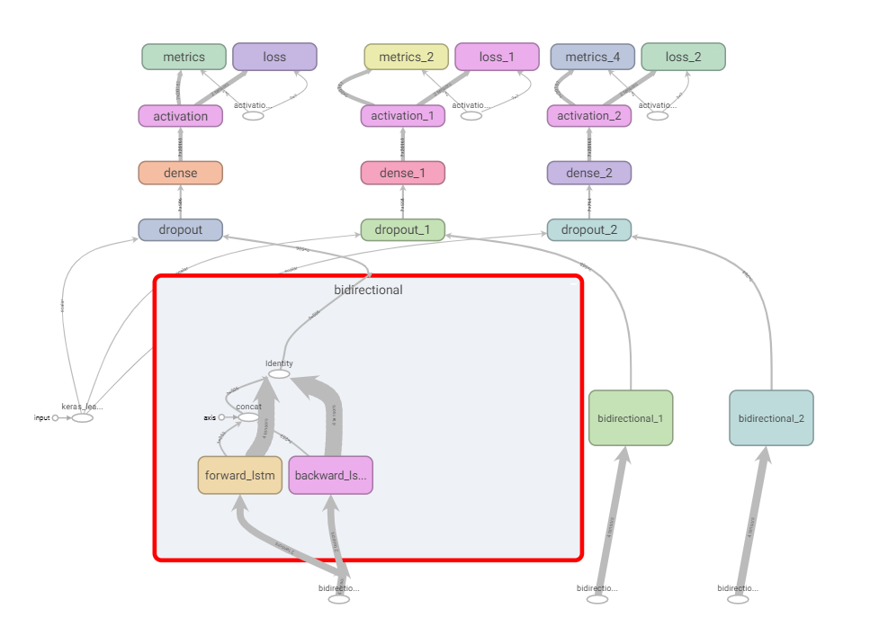
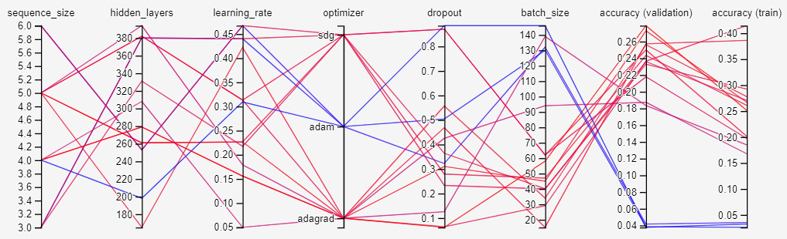
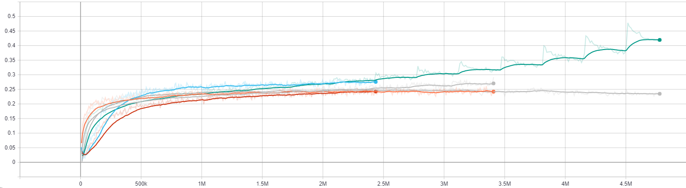
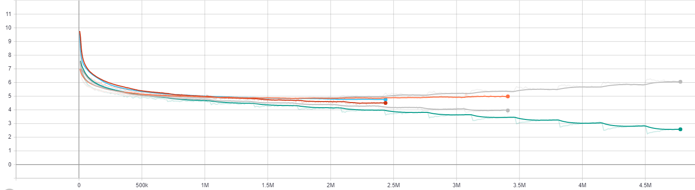
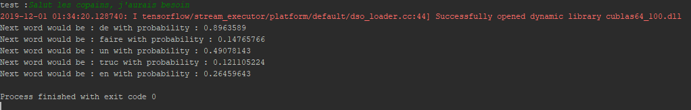

# Entraînement d’un modèle de clavier prédictif

## Introduction :
Les récentes évolutions numériques ont changé les usages de la société actuelle. Pour commencer, l’augmentation de la puissance de calcul des machines utilisées ont mis à la portée de tous des usages encore hors de protée il y a peu.
Mais en parallèle, nous avons aussi assisté à l’augmentation des usages. Dans notre quotidien, le numérique est partout et de nombreuses données sont créés à travers notre utilisation des outils numériques.
C’est cette rencontre entre les grands nombres de données et une puissance de calcul accrue qui permet de développer des outils d’apprentissage profond (deep learning).

La saisie de texte est un des domaines où s’applique particulièrement le deep learning. En effet, beaucoup de données sont générées lors de nos saisies via des claviers. Et ces données peuvent servir à entrainer des modèles dans plusierus but. A partir d’un texte, le deep learning peut par exemple faire de l’analyse de sentiment, de la reconnaissance d’entité nommé, de la détection de synonymes, de l’analyse de sentiments.
Ici, nous allons tenter de mettre au point un outil de clavier prédictif. Le but est de prédire ce qu’un utilisateur veut écrire, et de lui suggérer pour qu’il gagne du temps. Les claviers modernes de smartphone utilisent ce système pour la plupart (couplé à de la correction orthographique).

Enfin avant de rentrer dans le détail de l'étude, il faut préciser [comment consulter au mieux ce projet](doc/tensorboard.md).

## Données et corpus de texte utilisé :

Dans cette étude, je suis parti d’une conversation whatsapp partagée avec un groupe d’ami. J’avais deux certitudes avec ce jeu de donnée :
-	Son volume est suffisant : 40 000 messages pour environ 2,5M de lettres.
-	Sa qualité n’est pas excellente : on y trouve des fautes d’orthographe, des smileys, etc.

## Approche suivie:
Pour arriver à un modèle performant, j’ai suivi une méthodologie assez habituelle pour ce type de projet :

- **Preprocessing :** l’objectif du preprocessing est de normer les données pour obtenir des vecteurs exploitables par un modèle.
- **Modèles :** le modèle est responsable de la prédiction. Il prend en entrée un jeu de donnée d’entrainement et des hyper-paramètres pour mettre à disposition (après l’entrainement) une fonction de prédiction du prochain mot.
- **Optimisation :** J’utilise une technique d’évalutation des hyper paramètres pour juger de la meilleur combinaison possible pour un modèle donné.
- **Evaluation :** Les prédictions faite par un modèle sont faite sur un jeu de test et permettent de comparer les résultats obtenus.

## Preprocessing :
Le preprocessing avait deux objectifs :
-	Extraire de l’application whatsapp les messages pour obtenir une sorte de pièce de théatre. Les fichiers en questions sont disponibles
-	Construire un objet qui permette de construire une base de décomposition et ainsi passer du texte à des vecteurs (doc2vec). C’est l’objet [Preprocessor](Preprocessor.py) qui est utilisé.

Le preprocessing génère des séquences de vecteurs, afin d’entrainer un réseau de neurone récurrent (RNN, GRU, LSTM, etc.)
Le dictionnaire obtenu (c.a.d. la base orthonormée générée) contient 20 000 mots. On pourrait utiliser des techniques de réduction dimensionnelle (Embedding, TF-IDF, etc.) pour améliorer les résultats, si le besoin s’en fait sentir.

L'aspect des données après le préprocessing impose plusieurs choix techniques :
- **La ratio des données train/test :** dans le cas d'un jeu de donnée vraiment large, on peut réduire la proportion de test
- **La nécessitée d'un Batch Generator :** En effet quelques centaines de miliers de mots, répartis sur un dictionnaire de 20 000 mots, donnent un matrice assez volumineuse, qui ne tenait pas en mémoire sur mon poste. J'ai donc utilisé un batch generator. On lit les données progressivement, batch par batch. Le batch generator permet de mélanger les données (*shuffle*) et de créer les batches progressivement, pendant l'entraînement. Cela réduit la taille de mémoire nécessaire mais cela augmente le temps d'entraînement puisqu'on fait de la lecture/écriture à la place.

## Modèle :

Pour tous les modèles, la fonction de coût est binary crossentropy, et la métrique choisie pour évaluer les modèles est la categorical crossentropy. Ces choix sont dictés par le fait qu’on traite d’un modèle de classification dans 20 000 catégorie (taille du dictionnaire).
J’ai procédé par évolution successive du modèle. J’ai commencé par un modèle de RNN simple (faible performance : 0.3% de classification correcte). Je suis rapidement passé à un LSTM, qui semble une solution plébiscitée pour les réseaux de génération de texte (voir l'étude de l'université de Stanford dans la bibliographie). Les performances étaient meilleures (3% de classification correcte) mais pas encore suffisante. On trouve des performances de l’ordre de 30% dans la littérature. J’ai donc opté pour un nouveau modèle : LSTM bidirectionnel avec une couche dropout et une activation softmax (utile pour la classification vectorielle).

Ce dernier modèle était plus prometteur : environ 15% de classification correcte à première vue. J’ai donc opté pour ce modèle pour la suite de l’étude.

## Optimisation :

Afin de pousser les performances du modèle choisi, j’ai effectué une optimisation des hyper paramètres via une technique de grid search optimisation. Les résultats sont observés grâce à tensorboard.
J’ai également fait le choix de traiter comme des hyperparamètre du modèle certains hyperparmètre du preprocessing, afin de voir leur influence sur les résultats (notamment la longueur des séquences de mots extraites du texte).
J'ai fait plusieurs run, ou je modifiais progressivement le périmètre des hyperparamètres, pour les centrer vers l'optimum.

On constate que :
-	L'optimizer adam fonctionne mal
-	Les petits batch sont plus performants
-	Le reste des paramètres semble moins impactant pour les résultats
Voici quelques graphiques issus de tensorboard.

On termine avec un modèle qui performe autour de **35%** de précision de catégorisation, ce qui est assez remarquable vu la qualité supposée faible du jeu de données.
Voici un petit exemple de ce que renvoi le modèle à la fin de cette étude :

## Evaluation :

Si la méthode d’évaluation du modèle (categorical_crossentropy) est efficace pour juger un modèle de classification avec de nombreuses catégories, les claviers prédictifs sont souvent jugés avec une métrique spécifique : le nombre de frappe « économisées » par le clavier prédictif. J’ai donc calculé cette valeur pour le modèle réalisé. On obtient une mesure de 49%. Ce résultat est plutôt bon puisque la plupart des claviers prédictifs performent entre 30 et 70%.

## Pour aller plus loin :
Pour l’améliorer encore, on pourait tester l’influence d’une méthode de réduction dimensionnelle.
La deuxième piste pour améliorer les frappes économisées en vue de l’utilisation par une clavier (sur smartphone par exemple)  est de combiner l’approche mot par mot actuelle avec une seconde. En effet on prédit mot par mot, mais on essaye pas de prédire un mot quand l’utilisateur à déjà tapé la moitié du mot. Pour le faire, une approche par caractère est nécéssaire. Elle peut venir compléter notre approche par mot pour permettre de gagner encore plus de temps de saisie.

## Bibliographie :

- https://www.deeplearning.ai (via les supports coursera)
- https://keras.io/ (documentation)
- https://www.tensorflow.org/api_docs (documentation)
- https://medium.com/@david.campion/text-generation-using-bidirectional-lstm-and-doc2vec-models-1-3-8979eb65cb3a
- https://www.yorku.ca/mack/hcimobile02.html
- https://www.tensorflow.org/tensorboard/hyperparameter_tuning_with_hparams
- Evaluating Generative Models for Text Generation, *Prasad Kawthekar*, *Raunaq Rewari* and *Suvrat Bhooshan* - Stanford University
